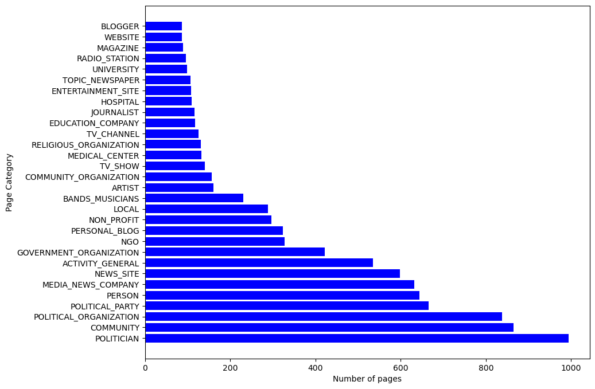
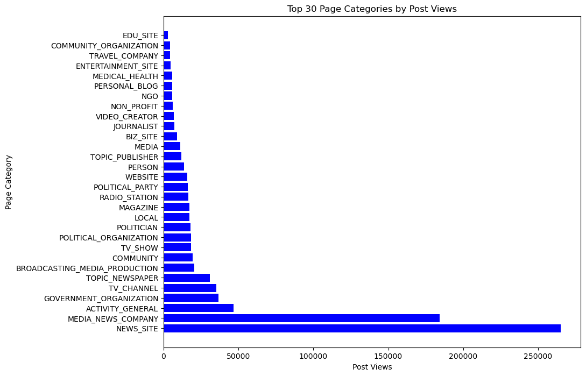

[](http://quantlet.de/)

## [](http://quantlet.de/) **EDA** [](http://quantlet.de/)

```yaml

Name of QuantLet : EDA

Published in : Covid-RO

Description : 'Exploratory Data Analysis'

Keywords : 'Facebook, sentiment analysis, Bitcoin'

Author: Daniel Traian Pele

Submitted : Mon, 04 December 2023

```





